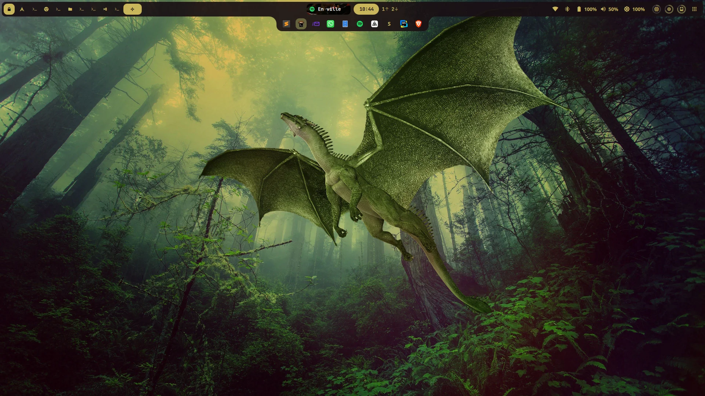
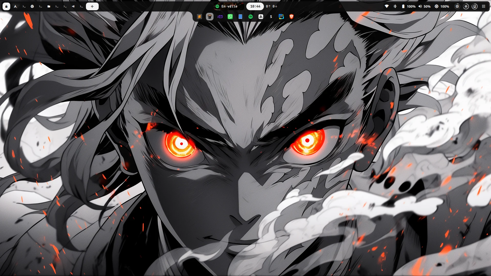
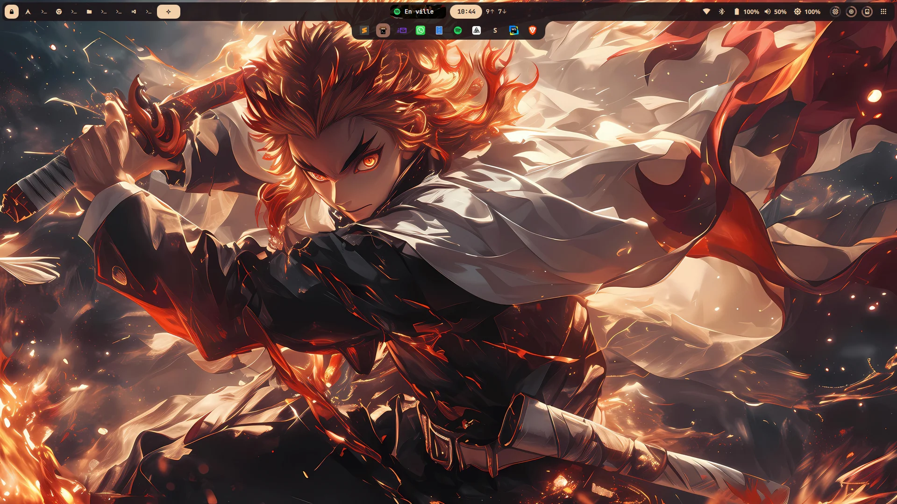

# ShellArie

A [Quickshell](https://quickshell.org) shell for **Hyprland** (Arch Linux): main bar, drop-down dashboard, notifications and a second bar showing your open applications.



<p>
  
  
</p>

The main bar sits at the top and the application bar is attached right below it. Colors follow the wallpaper.

## Features

- **Main bar**: workspaces (click to switch, drag and drop windows between them), clock, media player, network throughput, Wi-Fi / Bluetooth / Ethernet, battery, volume, brightness, resources (CPU / RAM / disk), Tailscale.
- **Dashboard** below the bar: overview, media (lyrics), performance, weather.
- **Notifications**: popups and a notification center with a Do Not Disturb mode.
- **Application bar** attached under the main bar, showing an icon for each open application:
  - click: jump to the application's workspace (launches it if it is closed);
  - right click: pin / unpin the application (kept across reboots);
  - shown with `SUPER + Tab`, automatically while rofi is open, and when the active workspace is empty.

## Requirements

| Component | Purpose |
|---|---|
| Hyprland ≥ 0.56 | actions use the Lua dispatcher syntax (`hl.dsp.*`) |
| `quickshell-git` (AUR) | the shell runtime |
| **Caelestia** QML module | components, services and configuration (build it from [caelestia-dots/shell](https://github.com/caelestia-dots/shell); it installs into `/usr/lib/qt6/qml/Caelestia`) |
| [`metricd`](https://github.com/Arch-Noah/metricd) | daemon providing CPU / RAM / disk / throughput through `$XDG_RUNTIME_DIR/metricd.sock` |
| `networkmanager`, `bluez`, `bluez-utils`, `wireplumber`, `libpulse`, `brightnessctl`, `upower`, `power-profiles-daemon` | network, Bluetooth, audio, brightness, power |
| `inotify-tools`, `openbsd-netcat` | file watching, access to the metricd socket |
| `rofi` | application launcher |
| `ttf-jetbrains-mono-nerd`, `ttf-material-symbols-variable-git` | icon fonts |

Optional: `ddcutil` (external displays), `tailscale`, `matugen`, `cava`, `libqalculate`, `grim`, the `caelestia` CLI (wallpapers, screen recording).

External scripts used when present in `~/.config/hypr/scripts/`:
- `qs_manager.sh`: panels opened by clicking the network, battery and volume widgets;
- `generate_qs_colors.sh`: writes the theme colors to `/tmp/qs_colors.json`.

## Installation

```bash
git clone https://github.com/Arch-Noah/ShellArie.git ~/.config/quickshell/ShellArie
cd ~/.config/quickshell/ShellArie
./install.sh --check   # check dependencies without changing anything
./install.sh           # install missing packages, create the state directory
```

`install.sh --yes` answers yes to every question. The script installs packages from the official repositories; Quickshell, the Caelestia module, the Material Symbols font and metricd must be installed by hand, and the script tells you which ones are missing.

### Hyprland configuration

In your Lua configuration:

```lua
-- start with the session
hl.exec_cmd("~/.config/quickshell/ShellArie/start.sh")

-- show / hide the application bar
hl.bind("SUPER + Tab", hl.dsp.exec_cmd(
    "qs ipc -p " .. os.getenv("HOME") .. "/.config/quickshell/ShellArie/shell.qml call taskbar toggle"))
```

## Usage

`./start.sh` (re)starts the shell and `./start.sh -q` stops it. Quickshell hot-reloads QML files when they change.

IPC commands (`qs ipc -p ~/.config/quickshell/ShellArie/shell.qml call <target> <function>`):

| Target | Function | Effect |
|---|---|---|
| `taskbar` | `toggle` | show / hide the application bar |
| `taskbar` | `togglePin <appId>` | pin / unpin an application |
| `dashboard` | `toggle`, `showTab <n>` | open the dashboard (on tab *n*) |

`qs ipc -p … show` lists every available target (media, volume, brightness, notifications…).

### Data and environment variables

| Item | Location |
|---|---|
| Pinned applications | `~/.local/state/shellarie/taskbar-pins.json` (`$XDG_STATE_HOME`) |
| Theme colors | `/tmp/qs_colors.json`, overridable with `QS_COLORS_FILE` |
| UI scale | `uiScale` in `~/.config/hypr/settings.json` |
| metricd socket | `$XDG_RUNTIME_DIR/metricd.sock` |

## Layout

```
shell.qml        entry point
bar/             main bar, application bar (Taskbar.qml), widgets
modules/         dashboard, notifications
services/        services (network, audio, Hyprland, Metricd, TaskbarPins, VPN…)
components/      reusable UI components
utils/           paths (Paths.qml), icons, JS helpers
commons/         styles and colors
assets/          fonts, images
```

## Troubleshooting

- **Empty bar or values stuck at 0 (CPU, RAM, throughput)**: check `systemctl --user status metricd`.
- **Clicking workspaces does nothing**: Hyprland < 0.56. The `hyprctl dispatch workspace 2` syntax is gone, actions go through `hl.dsp.*`.
- **Icons replaced by letters** in the application bar: the application has no icon in your icon theme.
- **Logs**: `qs log -p ~/.config/quickshell/ShellArie/shell.qml`.
